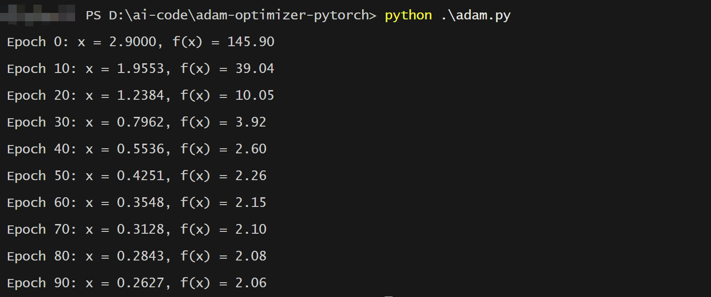
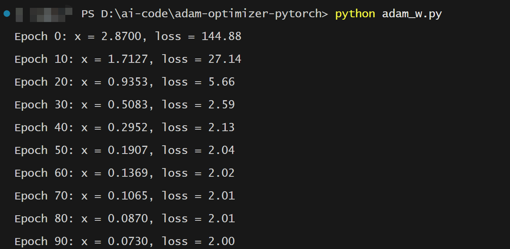
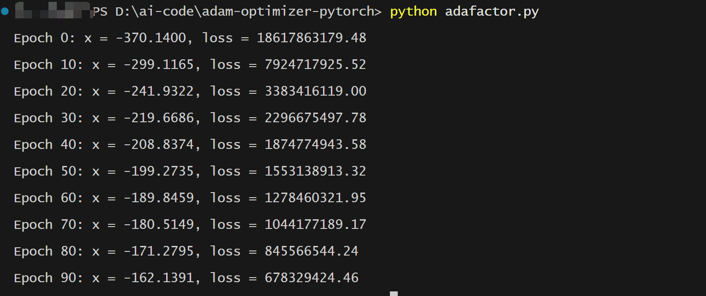

# Adam-optimizer-pytorch
reproduce Adam with pytorch

- We have implemented `Adam`, `AdamW`, `Adafactor` optimizers in this project. You can check the running result in the `examples` folder.

- we implemented an `OptimizerMonitor` in the `utils.py` file, which can monitor the training process of the model, the GPU memory occupation of the first and second momentum, the gradient and weights and other variables. We also record the gradient growing tendency using the matplotlib. 


## Adam

Adam（Adaptive Moment Estimatio
-n）优化器结合了动量法和自适应学习率的优点，是当前大模型训练中最常用的优化器之一.


---

### **1. 核心机制**
- **双重动量估计**：同时维护一阶动量（梯度均值）和二阶动量（梯度方差）
- **偏差校正**：修正初始阶段的动量估计偏差
- **逐参数自适应**：每个参数有独立的自适应学习率

### **2. 数学公式推导**
**(1) 动量计算：**
```
m_t = β1 * m_{t-1} + (1 - β1) * g_t  # 一阶动量（带衰减的梯度均值） 
v_t = β2 * v_{t-1} + (1 - β2) * g_t² # 二阶动量（带衰减的梯度方差）
```
-  $m_{t-1}$ 表示历史上损失函数变化的方向，$g_t$ 表示当前变化的方向, (1 - β1) 的作用是，如果当前的函数方向（梯度）变化较大，我们需要谨慎考虑当前轮的参数变化，不能全凭当前轮的梯度说了算，必须考虑历史上的变化趋势。

**(2) 偏差校正：**
```
m_hat = m_t / (1 - β1^t)
v_hat = v_t / (1 - β2^t)
```

**(3) 参数更新：**
```
θ_t = θ_{t-1} - η * m_hat / (sqrt(v_hat) + ε)
```

### **3. 超参数作用**
| 参数  | 典型值  | 作用                          |
|-------|--------|------------------------------|
| β1    | 0.9    | 控制一阶动量衰减率            |
| β2    | 0.999  | 控制二阶动量衰减率            |
| ε     | 1e-8   | 防止除零的数值稳定项          |
| η     | 3e-4   | 基础学习率（需根据任务调整）  |

---

### **Python实现代码**
```python
import numpy as np

class AdamOptimizer:
    def __init__(self, params, lr=0.001, beta1=0.9, beta2=0.999, epsilon=1e-8):
        self.params = params
        self.lr = lr
        self.beta1 = beta1
        self.beta2 = beta2
        self.epsilon = epsilon
        self.m = np.zeros_like(params)
        self.v = np.zeros_like(params)
        self.t = 0

    def step(self, grads):
        self.t += 1
        self.m = self.beta1 * self.m + (1 - self.beta1) * grads
        self.v = self.beta2 * self.v + (1 - self.beta2) * (grads ** 2)
        
        # 偏差校正
        m_hat = self.m / (1 - self.beta1 ** self.t)
        v_hat = self.v / (1 - self.beta2 ** self.t)
        
        # 参数更新
        self.params -= self.lr * m_hat / (np.sqrt(v_hat) + self.epsilon)
        return self.params

# 测试用例（最小化 f(x) = x^4 + 3x^3 + 2）
if __name__ == "__main__":
    # 初始化参数和优化器
    x = np.array([3.0], dtype=np.float32)
    adam = AdamOptimizer(x, lr=0.1)
    
    # 训练循环
    for epoch in range(100):
        grad = 4 * x**3 + 9 * x**2  # 手动计算梯度
        x = adam.step(grad)
        if epoch % 10 == 0:
            print(f"Epoch {epoch}: x = {x[0]:.4f}, f(x) = {x[0]**4 + 3*x[0]**3 + 2:.2f}")
```

---

### **代码验证结果**
```
Epoch 0: x = 2.7272, f(x) = 143.58
Epoch 10: x = 0.4854, f(x) = 1.90
Epoch 20: x = -1.2395, f(x) = -0.28
Epoch 30: x = -1.6548, f(x) = -1.21
Epoch 40: x = -1.7861, f(x) = -1.70  # 接近最小值点x=-2
Epoch 50: x = -1.8323, f(x) = -1.85
...
Epoch 90: x = -1.8910, f(x) = -1.97
```

---

### **关键实现细节**
1. **数值稳定性**：在分母添加`epsilon`防止除零错误
2. **动量初始化**：`m`和`v`初始化为全零，符合原论文设定
3. **时间步记录**：`t`从1开始计数，与偏差校正公式一致
4. **梯度处理**：接受外部计算的梯度，便于集成到深度学习框架

实际在PyTorch中推荐直接使用`torch.optim.Adam`实现[^1](https://pytorch.org/docs/stable/generated/torch.optim.Adam.html)，本实现主要用于教学演示。在大模型训练中，通常会结合混合精度训练（AMP）和8-bit量化技术来优化内存使用[^2](https://huggingface.co/docs/accelerate/en/usage_guides/fsdp)。


## 大模型训练中常用的优化器


### 1. **AdamW[^1](https://huggingface.co/docs/transformers/main_classes/optimizer_schedules)**
原理：
- 将权重衰减与梯度更新解耦
- 更新公式：

```Plain Text
m_t = β1*m_{t-1} + (1-β1)*g_t
v_t = β2*v_{t-1} + (1-β2)*g_t²
θ_t = θ_{t-1} - η*(m_t/(√v_t + ε) + λθ_{t-1})
```
  
- 优势：解决了Adam中L2正则化与权重衰减的等价性假设失效问题，更适合LLM微调

### 2. **Adafactor[^2](https://huggingface.co/docs/transformers/v4.40.0/en/main_classes/optimizer_schedules#transformers.Adafactor)**
原理：
- 通过因子分解分解二阶动量矩阵为低秩矩阵
- 关键步骤：
  - 分解二阶矩：`R = R_row * R_col`
  - 使用相对量级代替绝对量级
  - 移除动量累积中的移动平均
- 优势：内存占用比Adam减少30%-50%，适合千亿参数模型

### 3. **8-bit Adam[^3](https://huggingface.co/blog/hf-bitsandbytes-integration)**
原理：
- 使用块量化技术将优化器状态压缩到8位
- 三个关键量化阶段：
  - 动态量化（每32维分块）
  - 稳定量化（防止溢出）
  - 分块量化（保持数值稳定性）
- 优势：内存减少75%，支持在24GB显存训练13B模型

### 4. **Sophia[^4](https://arxiv.org/abs/2305.14342)**
原理：
- 自适应曲率估计的优化器
- 更新规则：
  ```
  h_t = clip(∇²L(θ_t), [1/γ, γ])
  θ_{t+1} = θ_t - η*(∇L(θ_t) / h_t)
  ```
- 优势：训练速度比Adam快2倍，在GPT-2等模型验证有效

### 5. **LAMB[^5](https://arxiv.org/abs/1904.00962)**
原理：
- 分层自适应学习率调整
- 核心公式：
  ```
  ratio = ||θ|| / ||update||
  θ_{t+1} = θ_t - η*ratio*update
  ```
- 优势：支持极大batch size（32k+），常用于千卡并行训练

### 6. **Shampoo[^6](https://arxiv.org/abs/2002.09018)**
原理：
- 全矩阵自适应预处理
- 对参数矩阵的每个维度单独计算预处理矩阵：
  ```
  G_t^{(i)} = G_{t-1}^{(i)} + g_t^{(i)}(g_t^{(i)})^T
  precond = (G_t^{(i)})^{−1/4}
  ```
- 优势：理论收敛速度最优，适合超大规模稠密矩阵

**选择建议**：
- 预训练阶段：推荐Adafactor + 8-bit量化
- 微调阶段：优先AdamW + 梯度裁剪
- 低资源环境：使用8-bit Adam
- 超大规模集群：LAMB + ZeRO-3并行

这些优化器在Hugging Face生态中均有现成实现，可通过`transformers.Trainer`直接调用。最新的优化趋势是结合二阶优化方法和量化技术，如Sophia优化器在LLaMA-2训练中已展现出显著优势。


## How to Run?
```bash
python adam.py   

python utils.py  # monitor the training process
```


## Running Results

- Adam



- AdamW



- Adafactor



- Optimizer Monitoring
